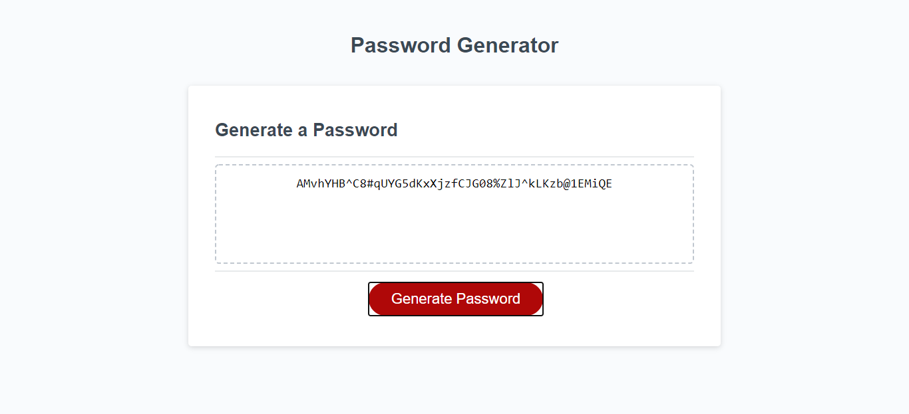

# Week_three_homework

Password Generator

## Week three home work project

Our week 3 project was to complete a password generator. We were provided the html and css files with a small part of the javascript completed. We were to add in the rest of the javascript to allow the required features to becoming active. We needed to provide the user the ability to choose the number of characters and which characters they would like to include in that password.

## This is the end result

## Where to access code

Week_three_homework git hub page. All docs are available in the Develop folder

## My contribution

The week 3 project was a lot more of a challenge for me. javascript is a much more complex writing of code ive had little to knoww experience in so this project took me considerably longer than the previous 2 assignments.

Alot of external study and I have started to grasp concepts but need alot more practice. I wrote the code to prompt the user request inputs which in turn, would generate a password with their desired commands. Anything that fell outside of those perimeters would prompt an invalid request.

As difficult as i found this, it has changed the way i looked at things and i am excited to put this to more practice in the future.

**explaining my page**
My page did not allow for too much creative freedom and focused more on the programming side. I elected to use minimal functions which was challenging. I discussed this with my teachers who recommended other ways to attempt in the future and the benefits but for the sake of the project, advised this was perfectly fine.

I would however be interested in going back through this when i am more competent to see ways i could reduce the amount of code and still maintain the same results.

[click for page link] (https://jarred-caris.github.io/Week_three_homework/.)
